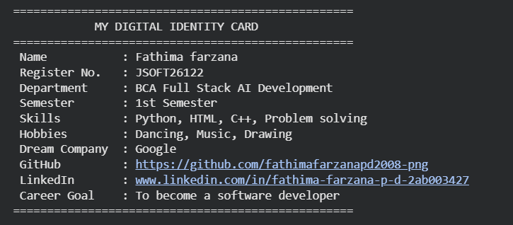
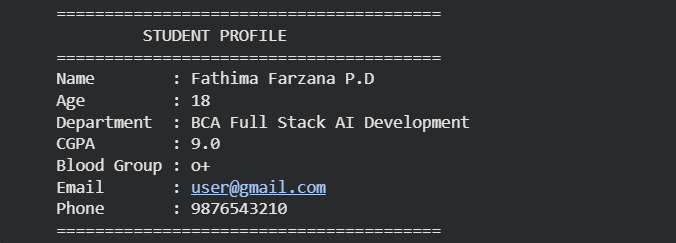
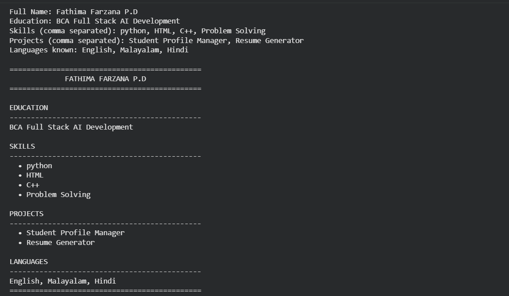
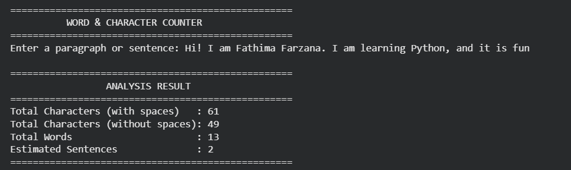

# Python Tasks

## Task 01: My Digital Identity 

### Description
Display my digital identity using Python.

### Output Screenshot

### Code
'Task_01_My_Digital Identity.ipnyb'

---

## Task 02: Student Profile Manager

### Description
Takes user input for student details and prints a formatted profile card

### Output Screenshot

### Code
'Task_02_student_Profile_Manager.ipynb'

---

## Task 03: Dynamic Resume Generator 
Generates a formatted, text-based resume using interactive user inputs.

*Code:* 'Task_03_Resume_Generator.ipynb'

---

## Task 04: Word $ Character Counter
Analyse users text input to calculate character counts, word counts, and sentence estimates.

*Code:* 'Task_04_Word_character_Counter.ipynb'
